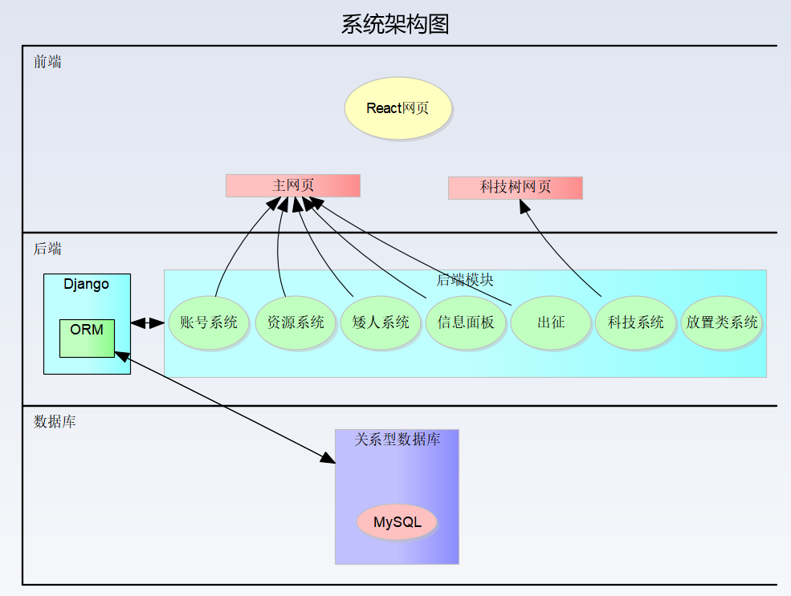
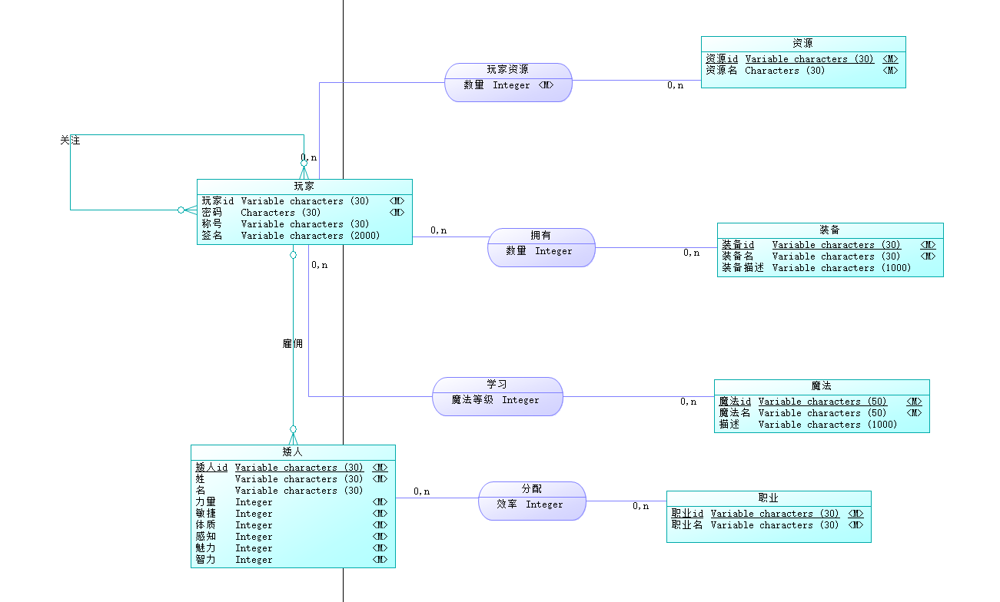
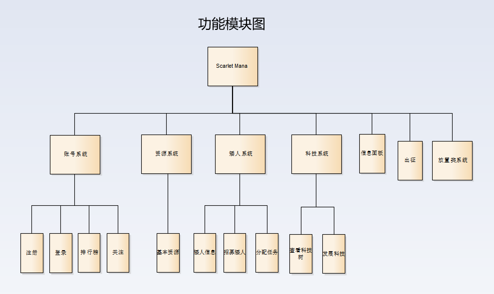
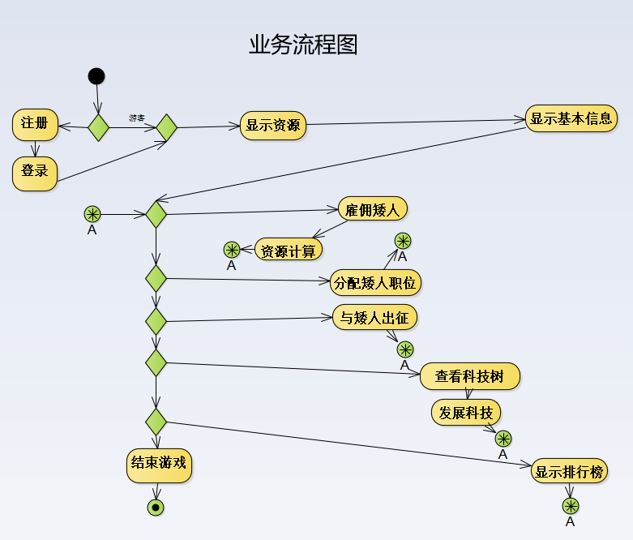

# ScarletMana

> 2023-BJTU-Web-Project
>
> 北京交通大学 软件学院 2023春季 实训课 Web大作业

## 1. 简介

### 1.1  基本信息

* 游戏名： [ScarletMana](scarletmana.com:3000)

- 这是一个网页端的文字游戏
- 理念：一个持续不断运行的世界，玩家可以通过网站访问，就算玩家不在，游戏内的时间也会继续流逝。
- 玩法：模拟经营、放置类
- 世界观：Dragon And Dungeon
- 背景：玩家是一名希望成为传奇魔法师的矮人矿场老板

### 1.2  机制

- 资源
  - 游戏中共有四种资源：金币、法力、矿物、佣兵
  - 法力：衡量玩家法术水平的数值，代表了玩家目前的战斗力、魔法能力。可以理解成：等级/经验值。
  - 金币：游戏中的基础货币。可以用金币雇佣矮人，购买装备等
  - 矿物：可以用于出售，或者打造装备（科技树），提升战斗力。
  - 佣兵：可以提升玩家战斗力。
- 资源循环
  - 金币雇佣矮人
  - 矮人开采矿物
  - 矿物换取金币
- 战斗系统
  - 玩家和矮人佣兵会持续不断地讨伐怪物，提升玩家的法力值。

  - 战斗力受到以下三者因素的影响：法力值、技能树/科技树、佣兵数量

- 雇佣矮人
  - 玩家可以 **花费金币雇佣矮人**，并派遣矮人执行不同的任务
  - 矮人可以执行不同的任务：矿工、商人、佣兵
    - 矿工：矿工会持续不断地 进入矿场 **采集矿物**
    - 商人：商人会持续不断地 **出售矿物换取金币**
    - 佣兵：佣兵会持续不断地 讨伐怪物
- 技能树/科技树
  - 可以使用法力来点技能、或者用金币与矿物升级装备等
  - 举例
    - 玩家可以使用法力来开发技能 `Fire Ball`，能提高战斗力
    - 玩家可以使用金币与矿物，升级矮人佣兵的装备，提高战斗力
- 排行榜
- 万能之书：咸鱼的笔记
  - 不知道哪里找到的笔记本，玩家点击输入信息向咸鱼祈祷，有概率得到玩家想要的回答。


## 2. 技术方案设计

### 2.1 前端 

* 框架 : React
* 响应式数据更新 : mobx
* 画树形图 : ReactFlow
* 所用到的组件库 : antd, material

### 2.2 后端

* 框架 : Django
* 所用到的库 : pymysql, django-import-export, openai, cyptography

### 2.3 数据库

* MySQL

### 2.4 技术架构



### 2.5 数据库设计



### 2.6 功能模块设计




## 3. 功能与实现

### 3.1 业务流程分析



### 3.2 功能的详细设计

- 资源
  - [前端：显示资源]
  - [后端：计算资源变化]
  - [数据库：玩家资源表]
- 资源循环
  - [前端：定时向后端请求玩家信息，跟新玩家数据]
  - [后端：通过游戏主循环，更新玩家资源]
  - [数据库：玩家资源表]
- 战斗系统
  - [前端：信息面板(输出各种事件信息)]

  - [后端：战斗逻辑]

  - [数据库：存储战斗信息]
- 雇佣矮人
  - [前端：显示矮人分配情况、分配员工(8个按钮)]
  - [后端：雇佣矮人逻辑]
  - [数据库：玩家表(存玩家及其矮人)、矮人信息表(存矮人及其职业)]
- 技能树/科技树
  - [前端：显示科技树、发展科技]
  - [后端：科技树逻辑、Buff逻辑]
  - [数据库：科技树（存科技树本身）、玩家科技(存玩家选了哪些科技，主键:玩家ID、科技ID)]
  - 科技树，外键依赖本表主键
- 排行榜
  - [前端：显示排行榜]
  - [后端：排行榜逻辑，关注逻辑]
  - [数据库：玩家表(存该玩家关注谁，被谁关注)]
- 万能之书：咸鱼的笔记
  - [前端：输入问题]
  - [后端：调用GPT回答问题]


## 4. 玩家手册

### 4.1 注册与登入

* 玩家访问 `scarletmana.com`，游戏显示出注册与登入页面。
* 玩家输入账户与密码，点击注册按钮，系统提示注册成功，并进入游戏主界面。

### 4.2 信息面板

* 玩家进入游戏主界面后，看到信息面板UI，信息面板显示介绍信息。

  * 介绍信息以玩家视角切入，交代游戏背景与目的。

  * 介绍信息内容有概率如下：

    > 你的祖父 **病逝** 了。
    >
    > 你收到了一封信，你从中了解到，你的祖父留下了一座 **庞大** 的 **废弃矿场**。
    >
    > 而你是这座废弃矿场的 **第一继承人**。
    >
    > 于是，你决定 **继承** 这座矿场，并将其发扬光大。
    >
    > 但谁知道，这座矿场中埋藏着一些 **上古** 遗留下来的 **神秘**......

### 4.3 矮人操作

* 介绍信息显示完毕之后，弹出：`资源-金币` 面板、`资源-矮人数量` 面板、 `招募矮人` 按钮。
* 玩家点击 `招募矮人` 按钮，金币数减少，矮人数量增加 $1$，同时，信息面板显示招募矮人信息。
* 玩家招募第一名矮人后，弹出：`矿工分配` 按钮、`三个职业的矮人数量` 面板
* 若玩家点击矿工分配的 `+` 号，矿工数量增加 `1`，同时信息面板显示对应信息
* 若玩家点击矿工分配的 `-` 号，则矿工数量减少 `1`，同时信息面板显示对应信息


### 4.4 资源增长

* 等待了对应的游戏时之后，玩家的矿物数量开始增长。
* 当矿物数量到达 `10` 时，弹出：`三个职业的分配按钮` 等 **全部** 资源面板与操作按钮。这个时候，玩家已经初步掌握了游戏的操作逻辑。有足够的能力进行自由地探索。


### 4.5 科技树

* 若玩家选中科技树上的一个节点，玩家可以看到这个科技的具体信息（花费与增益效果）
* 若玩家点击 `发展科技` 按钮，玩家点出对应科技，并在信息面板上显示对应信息。

### 4.6 排行榜

* 若玩家点击排行榜，玩家可以看到服务器上所有玩家的法力值排名。
* 若玩家点击关注某玩家，玩家可以关注这个玩家，并在关注者排行榜中看到其对应的信息。
  * 若已关注了该玩家，此操作会变为取消对该玩家的关注。
* 若玩家点击关注者排行榜，玩家可以看到自己关注的玩家的法力值排行榜，包括总榜上的信息。

### 4.7 万能之书：咸鱼的笔记

* 不知道哪里找到的笔记本，玩家点击输入信息向咸鱼祈祷，有概率得到玩家想要的回答。 
* 竟然！。。。。。是一只猫娘！！！


## 5. 协议

### 5.1 基本约定

- 所有请求均使用 `POST` 方法


### 5.2 账号相关

#### 5.2.1 注册

- `api/register/`
- 前端TO后端
  - username：账户名
  - password：密码
- 后端TO前端
  - state：状态。若成功则为 `success`；若失败则为 `error`
  - error_message：错误原因
  - token：令牌（只有在成功时才有值）

#### 5.2.2 登录

* `api/login/`
* 前端TO后端
  - username：账户名
  - password：密码
* 后端TO前端
  * state：状态。若成功则为 `success`；若失败则为 `error`
  * error_message：错误原因
  * token：令牌（只有在成功时才有值）

### 5.3 资源相关

#### 5.3.1 获取资源

* `api/resource/`
* 前端TO后端
  * token：令牌
* 后端TO前端
  * state：状态。若成功则为 `success`；若失败则为 `error`
  * error_message：错误原因
  * mana：法力
  * coin：金币
  * mineral：矿物
  * dwarf：矮人
  * miner：职业为矿工的矮人数量
  * merchant：职业为商人的矮人数量
  * soldier：职业为佣兵的矮人数量

### 5.4 矮人相关

#### 5.4.1 雇佣矮人

* `api/employ/`
* 前端TO后端
  * token：令牌
* 后端TO前端
  * state：状态。若成功则为 `success`；若失败则为 `error`
  * error_message：错误原因
  * message：信息面板内容
    * 这是一个 **JSON数组**
  * 接下来的属性均为雇佣矮人的属性
  * firstname：名
  * secondname：姓
  * sex：性别
  * strength
  * dexterity
  * constitution
  * intelligence
  * wisdom
  * charisma

#### 5.4.2 修改矮人职业

* 所有修改均采用同一协议，只有URI不同
* 前端TO后端
  * token：令牌
* 后端TO前端
  * state：状态。若成功则为 `success`；若失败则为 `error`
  * error_message：错误原因
  * message：信息面板内容
    * 这是一个 **JSON数组**

##### 5.4.2.1 增加矿工

* `api/dwarf/addMiner`

##### 5.4.2.2 减少矿工

* `api/dwarf/subtractMiner`

##### 5.4.2.1 增加商人

* `api/dwarf/addMerchant`

##### 5.4.2.2 减少商人

* `api/dwarf/subtractMerchant`

##### 5.4.2.1 增加佣兵

* `api/dwarf/addSoldier`

##### 5.4.2.2 减少佣兵

* `api/dwarf/subtractSoldier`

### 5.5 信息面板

#### 5.5.1 读取信息面板欢迎信息

* `api/message/`
* 前端TO后端
  * token：令牌
* 后端TO前端
  * state：状态。若成功则为 `success`；若失败则为 `error`
  * error_message：错误原因
  * message：信息面板内容
    * **注意**，这里的message是一个 **JSON数组**

### 5.6 排行榜

#### 5.6.1 金币排行榜

* `api/leaderboard/coin`
* 前端TO后端
  * token：令牌
* 后端TO前端
  * state：状态。若成功则为 `success`；若失败则为 `error`
  * rank{i}：排行榜上第i个玩家的信息，包括以下信息
    * UID：玩家的id
    * username：玩家的用户名
    * coin：玩家的金币数
    * following：是否正在关注该玩家
    * totalrank：玩家在总榜上的排名

#### 5.6.2 魔法排行榜

* `api/leaderboard/mana`
* 前端TO后端
  * token：令牌
* 后端TO前端
  * state：状态。若成功则为 `success`；若失败则为 `error`
  * rank{i}：排行榜上第i个玩家的信息，包括以下信息
    * UID：玩家的id
    * username：玩家的用户名
    * mana：玩家的法力值
    * following：是否正在关注该玩家
    * totalrank：玩家在总榜上的排名

#### 5.6.3 矿物排行榜

* `api/leaderboard/mineral`
* 前端TO后端
  * token：令牌
* 后端TO前端
  * state：状态。若成功则为 `success`；若失败则为 `error`
  * rank{i}：排行榜上第i个玩家的信息，包括以下信息
    * UID：玩家的id
    * username：玩家的用户名
    * mineral：玩家的矿物数
    * following：是否正在关注该玩家
    * totalrank：玩家在总榜上的排名

#### 5.6.4 关注玩家

* `api/leaderboard/subscribe`
* 前端TO后端
  * token：令牌
  * followed：关注的玩家ID
* 后端TO前端
  * state：状态。若成功则为 `success`；若失败则为 `error`
  * message：具体信息。
    * `successfully unsubscribe` 为成功取消关注
    * `successfully subscribeD` 为成功关注
    * `You always follow yourself. You are the only one who can own the power of ScarletMana!` 你永远关注着你自己，你可是要掌握绯红魔法的人！

#### 5.6.5 关注玩家金币榜

* `api/leaderboard/subscribe/coin`
* 前端TO后端
  * token：令牌
* 后端TO前端
  * state：状态。若成功则为 `success`；若失败则为 `error`
  * rank{i}：排行榜上第i个玩家的信息，包括以下信息
    * UID：玩家的id
    * username：玩家的用户名
    * coin：玩家的金币数
    * totalrank：玩家在总榜上的排名
    * following：是否正在关注该玩家

#### 5.6.6 关注玩家魔法榜

* `api/leaderboard/subscribe/mana`
* 前端TO后端
  * token：令牌
* 后端TO前端
  * state：状态。若成功则为 `success`；若失败则为 `error`
  * rank{i}：排行榜上第i个玩家的信息，包括以下信息
    * UID：玩家的id
    * username：玩家的用户名
    * mana：玩家的法力值
    * totalrank：玩家在总榜上的排名
    * following：是否正在关注该玩家

#### 5.6.7 关注玩家矿物榜

* `api/leaderboard/subscribe/mineral`
* 前端TO后端
  * token：令牌
* 后端TO前端
  * state：状态。若成功则为 `success`；若失败则为 `error`
  * rank{i}：排行榜上第i个玩家的信息，包括以下信息
    * UID：玩家的id
    * username：玩家的用户名
    * mineral：玩家的矿物数
    * totalrank：玩家在总榜上的排名
    * following：是否正在关注该玩家

### 5.7 技能相关

#### 5.7.1 查看技能列表

* `api/skill/query_all_skills`

* 前端TO后端

  * token：令牌

* 后端TO前端

  * state：状态。若成功则为 `success`；若失败则为 `error`

  * error_message：错误原因

  * data：数据库详细信息

    * data是一个List

    * List中的每个元素是一个Dictionary

    * Dictionary包含以下键值对

      * "id": int
        * ID
      * "name": string
        * 名字
      * "effect_describe": string
        * 效果描述
      * "background_describe": string
        * 背景描述
      * "precondition": int
        * 前置技能ID
      * "mana_cost", "coin_cost", "mineral_cost"
        * 资源花费，需要有这些资源，才可以学习这个技能
        * **注意！**这些Key **可能不存在**，不存在时，则表示对这个资源 **没有需求**
      * "dwarf_limit"
        * 矮人限制，需要有这些数量的矮人，才可以学习这个技能
        * 只对数量进行限制，不消耗矮人
        * **注意！**这个Key **可能不存在**，不存在时，则表示对这个资源 **没有限制**

    * 例子：

      ```json
      [
          {
              "id": 1,
              "name": "失落的绯红魔法书",
              "effect_describe": "矿场中的这本失落魔法书让你开始学习魔法...",
              "background_describe": "\"潘多拉的魔盒被打开了...\"",
              "precondition": 0,
              "coin_cost": 1
          },
          {
              "id": 2,
              "name": "魔法书的扉页",
              "effect_describe": "你开始了解到了这本书蕴藏的强大力量",
              "background_describe": "[写在魔法书扉页上的文字]",
              "precondition": 1,
              "mana_cost": 5
          },
              {
              "id": 3,
              "name": "照明术",
              "effect_describe": "可以让你照亮周围的环境",
              "background_describe": "你从镇上的市场中购...",
              "precondition": 1,
              "coin_cost": 10
          }
      ]
      ```

#### 5.7.2 学习技能

* `api/skill/learn`
* 前端TO后端
  * token：令牌
  * skill_id：想学习的技能ID
* 后端TO前端
  * state：状态。若成功则为 `success`；若失败则为 `error`
  * error_message：错误原因

#### 5.7.3 查看玩家所学习的所有技能ID

* `api/skill/query_learned_skills`

* 前端TO后端

  * token：令牌

* 后端TO前端

  * state：状态。若成功则为 `success`；若失败则为 `error`

  * error_message：错误原因

  * learned_skills：已经学习到的技能

    * 这是一个List，里面每个元素都是一个Integer，表示技能的ID

    * 保证元素从小到大

    * 例：

      ```json
      [1, 2]
      ```

### 5.8 LLM

#### 5.8.1 Chat

* `api/llm/chat`
* 前端TO后端
  * username：字符串，表示用户名称（目前没有作用）
  * target：对话目标
    * 比如设置为"Neko"的话，就会自动触发猫娘人设
  * message：对话内容
* 后端TO前端
  * state：状态。若成功则为 `success`；若失败则为 `error`
  * error_message：错误原因
  * message：LLM的返回信息

#### 5.8.2 Reset

* `api/llm/reset`
* 前端TO后端
  * 无
* 后端TO前端
  * state：状态。若成功则为 `success`；若失败则为 `error`
  * error_message：错误原因
